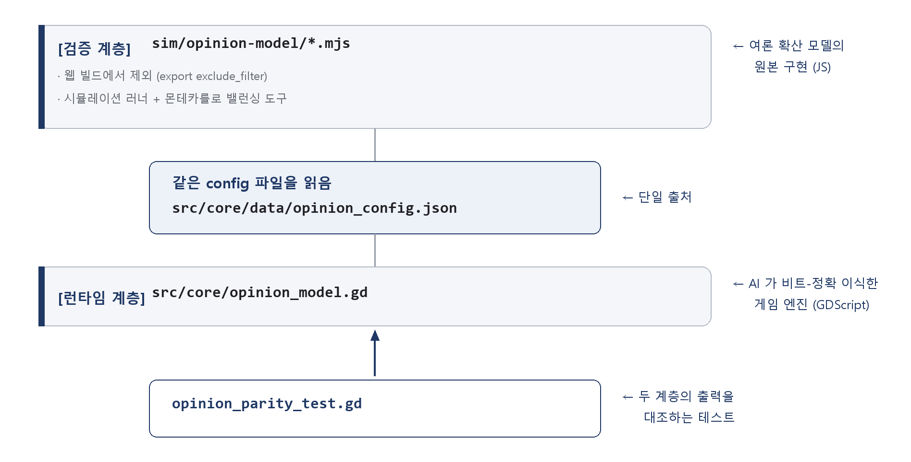

# AI 활용 기술 문서 — 가이드라인 (GUIDELINE) / TeamNuN

> **한 줄 요약**: 이 게임은 "AI가 만든 게임"이다 — 사람은 디렉션·설계 결정·감각 판단·최종 검수만 하고,
> 코드·아트·사운드·게임 텍스트 생성과 그 **검증**까지를 명령(prompt) 기반 AI 파이프라인이 수행했다.
> 그리고 그 신뢰성은 역설적으로 **AI를 의도적으로 쓰지 않은 지점**(결정론 여론 엔진·절차 사운드·몬테카를로 밸런싱)이 보증한다.

| | |
|---|---|
| 작품 | 가이드라인 (GUIDELINE) |
| 저장소 | https://github.com/JiwonKim-kr/artificer-pipeline (브랜치 `game/gireki-sim`) |
| 플레이 링크 | https://jiwonkim-kr.github.io/artificer-pipeline/ |
| 엔진 | Godot 4.6.3 (웹 export, Compatibility 렌더러) |

---

# 1. 개요 — 무엇을 만들었는가

두 가지를 동시에 만들었다.

1. **게임** 「가이드라인」 — 여론 시뮬레이션 내러티브 게임.
2. **게임을 만드는 AI 파이프라인** — 게임 개발에서 사람이 직접 해야만 하는 일(아이디어·디렉션, 로직의 설계 결정,
   재미·감각 판단, 최종 검수)을 제외한 대부분을 **명령만으로** 처리하는 오케스트레이션 체계.

저장소 자체가 파이프라인이고, 게임은 그 파이프라인의 검증 대상이다. 따라서 이 문서의 주제는
"AI로 그림을 뽑고 코드를 짰다"가 아니라 **"AI 산출물을 어떤 구조로 신뢰 가능하게 만들었는가"** 이다.

**규모 (실측)**

| 항목 | 수치 |
|---|---|
| 슬래시 명령 정의 | 21개 (`.claude/commands/`) |
| 파이프라인 스크립트 | 18개 (`pipeline/scripts/`, Python) |
| 파이프라인 자기검증 러너 | 8개 (`pipeline/tests/run_*.py`) |
| 게임 코드 | `src/ui/main.gd` 2,385줄 · `src/core/` 3파일(엔진 이식·RNG·턴 오케스트레이션) |
| 검증 계층(오라클) | `sim/opinion-model/` 4파일 (JS, 웹 빌드 제외) |
| 승인된 구현 명세 | 4종 (`docs/specs/`) |
| 콘텐츠 | 사실 16종·댓글 143건·기사 prose 16×3프레임 |
| 에셋 | UI 아트 13종(+ 탐색 컨셉 13종) · 효과음 10종 · BGM 2종 — **전부 자체 생성** |

---

# 2. 기술 구조 (1) — 2계층 아키텍처: AI 산출물을 어떻게 믿는가

**문제**: AI가 생성한 게임 로직을 어떻게 믿는가? 특히 여론 확산처럼 결과가 복잡한 시스템은
"그럴듯하게 동작하는 것"과 "정확히 동작하는 것"을 눈으로 구분할 수 없다.

**해결**: 정답 기준(오라클)을 별도 계층으로 두고, AI 산출물을 그것과 **기계적으로 대조**한다.



**핵심 설계 3가지**

1. **config 단일 출처**: 모델 상수(세그먼트 성향·확산 계수·발각 확률·미션 목표)를 담은
   `opinion_config.json` **한 파일**을 오라클과 게임이 같이 읽는다. 상수를 양쪽에 복사하면
   반드시 드리프트가 생기므로, 물리적으로 하나만 존재하게 했다.

2. **비트-정확(bit-exact) 이식**: JS와 GDScript는 정수·부동소수 처리가 다르다. 특히 난수 생성기
   mulberry32는 `Math.imul`(32비트 곱셈 오버플로 래핑)에 의존하는데, GDScript에는 대응 연산이 없다.
   → 16비트 분할 곱셈으로 JS 시맨틱을 재현했다:
   ```gdscript
   static func _imul(x: int, y: int) -> int:   # JS Math.imul 재현
       var xl := x & 0xFFFF; var xh := (x >> 16) & 0xFFFF
       var yl := y & 0xFFFF; var yh := (y >> 16) & 0xFFFF
       return ((xl * yl) + (((xh * yl + xl * yh) & 0xFFFF) << 16)) & 0xFFFFFFFF
   ```

3. **골든 픽스처 대조**: 오라클이 생성한 정답값을 커밋해두고(`pipeline/tests/fixtures/opinion_golden.json`),
   게임 엔진이 같은 값을 내는지 헤드리스로 검사한다.

**실측 증명** (`opinion_parity_test.gd`, 이 문서 작성 시점 재실행 PASS)

| 대조 항목 | 결과 |
|---|---|
| RNG 시퀀스 (uint32 16개) | **정수 완전 일치** |
| 시나리오① 1턴 후 세그먼트 값 | **부동소수 동일** (부동층 0.522621…) |
| 발각 경로 8턴 누적 확률·발동 시점 | **완전 일치** |

이 테스트는 CI(GitHub Actions)가 push마다 자동 실행한다. **엔진을 건드려 정확성이 깨지면 병합 전에 잡힌다.**

---

# 3. 기술 구조 (2) — 명령 파이프라인과 사람 승인 지점

게임 개발 작업을 4개 트랙으로 나누고, 각 트랙을 슬래시 명령으로 정의했다.
**사람의 결정이 필요한 지점 3곳은 명령 정의 자체에 "생략 불가"로 못 박혀 있다.**

| 트랙 | 명령 | AI가 하는 일 | 사람이 하는 일 |
|---|---|---|---|
| **lore** (세계관) | `lore init` / `query` / `check` / `export` | canon 문서 생성, 관련 항목 검색, 표기·모순 기계 검사, 게임 텍스트 생성 | 컨셉 문답 |
| **play** (로직) | `play spec` / `build` / `test` | 아이디어→구현 명세, 명세→GDScript+씬, 헤드리스 테스트 | ★ **spec 승인** |
| **art** (그래픽) | `art concept` / `lock` / `gen` / `reskin` | 컨셉 후보 생성 → 스타일 모델 학습 → 에셋 생성 → 씬 경로 일괄 교체 | ★ **art lock 승인** |
| **se/bgm** (사운드) | `se gen` / `attach`, `bgm gen` | 절차 생성 → 라우드니스 정규화 → 씬 자동 배선 | 검수 |
| **공통** | `plan` / `verify` / `review` / `status` | 태스크 분해, 5게이트 검증, 현황 보고 | ★ **review 승인** |

## 3.1 유기성의 장치 — 에셋 매니페스트

트랙이 서로를 어떻게 아는가? `pipeline/manifest.json` 단일 기록을 경유한다.
"어떤 씬 노드/코드 이벤트가 어떤 에셋을 필요로 하는가"를 기계가 읽을 수 있게 적는다.

```json
{ "id": "se:ui/publish", "track": "se", "status": "generated",
  "spec": "발행 → 타자기 카춘크(이중 클랙). jsfxr, 절차생성.",
  "requested_by": [{ "kind": "code_event", "path": "src/ui/main.gd::article_published" }],
  "file": "assets/audio/se/publish.ogg" }
```

- `play build`가 플레이스홀더를 만들 때 **요구사항을 매니페스트에 등록**한다.
- `art reskin` / `se attach`는 매니페스트를 읽어 **씬을 자동으로 고친다** — 사람이 경로를 손으로 잇지 않는다.
- `verify` 게이트 #4가 **매니페스트 ↔ 실제 파일 정합성**을 검사한다. 등록 없는 에셋, 파일 없는 등록 모두 실패.

실제로 `se attach`는 이 기록만으로 씬에 브리지 노드(`SeEmitter`)를 삽입해 시그널을 구독시킨다.
게임 코어 로직은 사운드의 존재를 전혀 모른다 — 결합도 0.

## 3.2 검증 게이트 (verify)

반영 전에 5가지를 전부 통과해야 한다.

| # | 게이트 | 내용 |
|---|---|---|
| 1 | Godot headless 임포트 | 에셋·스크립트가 실제로 임포트되는가 |
| 2 | 스모크 테스트 | main_scene 인스턴스화 성공 (런타임 크래시 검출) |
| 3 | 네이밍/디렉토리 규칙 | snake_case, 보호 영역, 확장자, 플레이스홀더 접두사 |
| 4 | 매니페스트 정합성 | 스키마 + 실제 파일 존재 대조 |
| 5 | lore 정본 모순 | 용어 표기 불일치·중복 정의·미등재 검사 |

GitHub Actions가 push/PR마다 전체 실행한다(`.github/workflows/verify.yml`, Godot 4.6.3 고정).

---

# 4. 사용 AI 도구 + 활용 내역

| 도구 | 용도 | 산출물 (실측 수치) |
|---|---|---|
| **Claude / Claude Code** (Anthropic) | 코드·씬 생성(spec→GDScript), 여론 엔진 비트-정확 이식, UI 전체·연출, 파이프라인 스크립트(Python) 작성, 게임 텍스트 생성, 문서 작성 | 게임 UI `src/ui/main.gd` 2,385줄 · 코어 3파일 · 파이프라인 스크립트 18종 · 검증 러너 8종 · 제출 문서 |
| **FLUX** (범용 이미지 모델, Scenario 경유) | `art concept` — 스타일 확정 전 컨셉 후보 탐색 | 디젤펑크 컨셉 **13종** → 사람이 선별 |
| **Scenario** (커스텀 스타일 모델 학습·생성) | `art lock`(선별 컨셉으로 스타일 모델 학습, 2026-08-01 사람 승인) + `art gen` | 스타일 모델 `taeyeop-dieselpunk` 고정(`docs/style_guide.md`) · UI 아트(책상 배경·창 프레임·여론계 게이지 등) |
| **GPT Image 2** (Scenario 경유, 수동 생성) | 배경 점등 변형 등 개별 아트 | `desk_bg_monitor.png`(모니터 hover 점등) 외 |
| **lore export** (Claude 생성 + 스크립트 검증) | 세계관 정합 게임 텍스트 대량 생성 — 생성은 AI, **검증은 기계** | 댓글 뱅크 **87→143건** 확장 |

※ **탐색 후 폐기**: Gemini(Google) — 초기 배경 시안에 시험했으나 퀄리티 문제로 폐기, **최종 산출물에 미사용**.

---

# 5. AI 대상 주요 프롬프트 · 지시 사항

이 프로젝트에서 프롬프트의 핵심은 "무엇을 만들어라"가 아니라 **"무엇을 하지 마라 / 무엇으로 증명하라"** 였다.
아래는 실제 명령 정의(`.claude/commands/*.md`)와 규칙 파일(`CLAUDE.md`)에 담긴 지시의 요약이다.

### 5.1 상시 주입되는 오케스트레이션 규칙 (`CLAUDE.md`)

모든 명령에 공통으로 적용되는 상위 규칙:

> - 모든 실행 명령은 「**생성 → 자동 검증 → 사람 검수 → 반영**」 순서를 지킨다.
> - 트랙 간 연결은 반드시 `pipeline/manifest.json`을 경유한다. **매니페스트를 갱신하지 않는 에셋 생성/교체는 금지.**
> - 설정·세계관이 필요한 명령은 실행 전 `lore/canon/`에서 관련 항목만 추출해 컨텍스트로 쓴다. **정본과 모순되는 산출물을 만들지 않는다.**
> - `src/core/`는 **사람이 승인한 spec 없이 수정 금지**.
> - 카탈로그에 없는 동작은 임의로 수행하지 않고 제안만 한다.

### 5.2 여론 엔진 이식 지시 (가장 중요한 프롬프트)

> "`sim/opinion-model/opinion-model.mjs`를 GDScript로 **비트-정확** 이식하라.
> JS `Math.imul`의 32비트 래핑 시맨틱을 16비트 분할 곱으로 재현하고, 부동소수 연산 순서를 바꾸지 마라.
> 함께 **골든 픽스처 대조 테스트**를 작성하라 — `makeRng(1)`의 첫 16개 uint32와 시나리오① 1턴 결과를
> 오라클에서 덤프해 커밋하고, 게임 엔진 출력이 **정수 완전 일치·부동소수 동일**임을 헤드리스로 검사할 것."

→ 결과: §2의 parity 증명. **"만들어라"가 아니라 "증명 수단을 함께 만들어라"** 가 지시의 핵심.

### 5.3 `play spec` — 아이디어를 승인 가능한 명세로

> "아이디어를 구현 명세로 변환하라. 반드시 포함할 것: 대상 파일 목록 · **관찰 가능한 수용 기준**(주관적 표현 금지) ·
> 자동 검증 방법 · 범위 밖 항목. `src/core/`를 건드리는 변경은 이 명세의 사람 승인 없이 진행할 수 없다.
> 승인 전에는 코드를 작성하지 마라."

→ 결과: 승인된 명세 4종. 각 명세는 "부동층 x가 상승 방향" 같이 **테스트로 판정 가능한 기준**만 담는다.

### 5.4 `art lock` — 스타일 고정 (사람 승인 지점)

> "선택된 컨셉 5~15장으로 Scenario 커스텀 스타일 모델을 학습시켜라.
> **잠금(모델 ID 확정 + `manifest.style_guide` 기록 + 스타일 가이드 문서 작성)은 사람 승인 후에만** 수행한다.
> Claude가 임의로 잠그지 않는다. API 키·시크릿은 문서/매니페스트에 남기지 않는다(모델 ID는 비밀이 아니나 키는 `.env` 전용)."

### 5.5 `lore export` — 세계관 정합 텍스트 생성 (생성은 AI, 검증은 기계)

> "canon 발췌를 근거로 세그먼트 페르소나에 맞는 댓글 변주를 생성하라 —
> SNS 반대층=강철 형제단의 생계 위협 어조, 올드미디어 찬성층=격식체, 무관심층=냉소·짧은 문장.
> **제약**: topic은 canon 정본 10종(생산성·안전·신직종·경쟁·실업·임금·인격·무력충돌·유착·비공개)만,
> 슬롯은 `{키워드|대상|수치|집단}`만 허용. 기존 뱅크와 중복 금지.
> 산출물은 `lore_export.py validate`를 통과해야만 반영된다."

이 명령의 설계 요점: **LLM에게 창의성을, 스크립트에게 판정을 맡긴다.** 검증기는 다음을 기계적으로 차단한다.

- 스키마 위반(필드 누락·id 형식)
- canon에 없는 topic
- 미지원 슬롯 (`{회사명}` 같은 것 → 화면에 리터럴 노출되는 사고 방지)
- 기존 뱅크와 id/text 중복
- **"죽은 조합"** — 코어 선택 로직상 절대 노출될 수 없는 세그먼트×반응 쌍
  (예: 무관심층은 항상 "시큰둥"이므로 `apathetic × 수용`은 만들어도 화면에 안 나옴)

실제로 이 검증기가 **기존 뱅크에 이미 있던 죽은 엔트리 4건**을 검출했다 — 사람이 손으로 만든 데이터의 결함을,
AI 생성물 검증용으로 만든 도구가 잡아낸 사례.

### 5.6 프롬프트 설계 원칙 (요약)

| 원칙 | 구현 |
|---|---|
| 결정권을 코드로 강제 | "승인 후에만", "spec 없이 수정 금지" 를 명령 정의에 명문화 |
| 산출물과 함께 검증 수단 요구 | 이식 지시에 골든 대조 테스트 작성 포함 |
| 판정은 기계에 위임 | 생성=LLM / 검증=스크립트 (lore export, verify 게이트) |
| 하드코딩 금지 | 장르·스타일 의존 로직을 명령·스크립트에 넣지 않고 데이터(lore·manifest)로만 표현 |
| 비밀 취급 | API 키는 `.env` 전용, 산출 문서·매니페스트에 기록 금지 |

---

# 6. AI를 쓴 곳 vs 의도적으로 쓰지 않은 곳 ★

**썼다**: 코드(엔진 이식·UI 전부)·아트(FLUX/Scenario/GPT Image 2)·게임 텍스트(lore export)·문서. — 목적은 **생산성**.

**의도적으로 쓰지 않았다**: 신뢰성·재현성이 목적인 축은 **결정론**으로 못 박았다.

| 축 | AI 대신 쓴 것 | 이유 |
|---|---|---|
| **여론 엔진 런타임** | 검증된 결정론 모델(bounded-confidence + 확증편향 대역 + 역풍 + 톤×감정 공명 + 발각/평판) | 결과가 "그럴듯한 생성"이 아니라 **재현 가능한 창발**이어야 한다. 같은 입력 → 같은 결과가 보장돼야 밸런싱이 성립 |
| **찌라시(허위 소문) 자생** | 튜닝 파라미터 기반 확률 모델(`lever_tuning.json`의 `rumor` 블록 — 기본 확률·턴별 열기 상승·상한) + **표현층 격리**(여론·발각 수치에 영향 없음) | 플레이어가 만들지 않은 소문이 "자생"하는 연출이 필요하되, **게임 밸런스에는 영향을 주지 않아야** 한다. 승인된 명세(`docs/specs/rumor_emergence.md`)로 경계를 명문화하고 헤드리스 테스트로 게이팅을 검증 |
| **효과음 10종** | jsfxr 절차 생성(시드 고정) + ffmpeg -16 LUFS 정규화 | 동일 spec → **동일 바이트**. 외부 저작권 원천 배제 |
| **BGM 2종** | ffmpeg 절차 합성(`bgm_gen.py`) — 전력망 험 50/100/150Hz + 핑크노이즈 + CRT 편향코일 험 | 외부 음원·API 0. 심리스 루프를 위해 모든 사인 주파수를 루프 길이의 정수배로 잡음 |
| **밸런싱** | 몬테카를로 시뮬레이션 **N=4,000** (`balance_montecarlo.mjs`) | 감으로 정하지 않는다. 난이도 곡선을 실측으로 확정 |
| **최종 검수** | 사람 (승인 지점 3곳 생략 불가) | 결정권은 사람에게 |

## 6.1 밸런싱 실측 사례

`maxTurns=8` · 발각 파탄 임계 3 구성에서 전략별 4,000회 시뮬레이션 결과:

| 전략 | 성공률 | 평균 승리 턴 | 발각 파탄 | 실패 |
|---|---|---|---|---|
| 정직 (전부 공개) | **0.0%** | — | 0.0% | 100% |
| 은폐1 (최소 왜곡) | **76.7%** | 6.2 | 5.3% | 18.0% |
| 은폐2 (중간 왜곡) | 35.6% | 5.2 | 24.2% | 40.2% |
| 은폐 전부 (δ=1) | 9.9% | 4.5 | 46.5% | 43.5% |

읽는 법: **"정직만으론 구조적으로 못 이기고"**(주제의식의 수치 구현), **"더 숨기고 싶은 유혹이 수학적으로 함정"**
(은폐2부터 승률 반토막). 이 곡선은 사람이 감으로 정한 것이 아니라 시뮬레이션으로 확정했고,
`node sim/opinion-model/balance_montecarlo.mjs` 한 번으로 **소수점까지 재현**된다.

> **AI가 만든 것을, AI가 아닌 방법으로 검증한다** — 이 분리가 본 프로젝트의 핵심 판단이다.

---

# 7. 외부 에셋 / 오픈소스 출처 · 라이선스

## 7.1 외부 오픈소스 / 폰트

| 항목 | 출처 | 라이선스 | 용도 |
|---|---|---|---|
| Godot Engine 4.6.3 | godotengine.org | MIT | 게임 엔진 (배포물에 런타임 포함) |
| **Neo둥근모(neodgm) 폰트** | Eunbin Jeong (Dalgona.) · 라이선스 전문 동봉 `assets/fonts/neodgm_ofl_license.txt` | **SIL Open Font License 1.1** | 웹 빌드 한글 렌더 (게임에 번들) |
| jsfxr 1.4.1 | github.com/chr15m/jsfxr (npm) | **Public Domain** (저장소 UNLICENSE 원문 확인, 2026-08-04) | 효과음 절차 생성 (개발 도구) |
| wasm-media-encoders 0.7.0 | npm | MIT | WAV 인코딩 (개발 도구) |
| ffmpeg | ffmpeg.org (gyan.dev 빌드) | GPL/LGPL | 라우드니스 정규화·BGM 합성 (**개발 도구 — 배포물에 미포함**, 산출 OGG만 게임에 포함) |
| certifi / Pillow (Python) | PyPI | MPL-2.0 / MIT-CMU | 파이프라인 스크립트 (개발 도구) |

## 7.2 자체 생성 에셋 (전부 자체 보유 · 생성 도구 명시)

| 항목 | 생성 방식 | 재현 근거 |
|---|---|---|
| **아트 13종** (책상 배경·점등 변형·창 프레임·여론계·엔딩 4종·편집장 3종·메일·신문 프레임) | FLUX 컨셉 탐색 → **Scenario 커스텀 스타일 모델**(`taeyeop-dieselpunk`) → `art gen`, 일부 **GPT Image 2**(Scenario 경유) 수동 생성 | `pipeline/manifest.json`(각 항목의 생성 명세) · `docs/style_guide.md` |
| **효과음 10종** | **jsfxr 절차 생성**(시드 고정) + ffmpeg -16 LUFS 정규화 | `pipeline/se_specs/*.json` 커밋 — 동일 시드 → 동일 바이트 |
| **BGM 2종** | **ffmpeg 절차 합성** (외부 음원 0) | `pipeline/scripts/bgm_gen.py` |
| **게임 텍스트 전부** (세계관 canon·사실 16종·기사 prose·댓글 143건) | 사람 기획 + Claude 생성 + `lore export` 기계 검증 | `lore/canon/` · `src/core/data/content_slice.json` |

**외부 유료 에셋·타인 저작물 사용 없음.** 현실 인물·실제 사건·실존 기업 미등장 — 완전 가상 세계관(`lore/canon/world.md`).

---

# 8. 재현성 · 검증

| 대상 | 재현 방법 | 보장 수준 |
|---|---|---|
| 효과음 | `se_jsfxr.py render --spec pipeline/se_specs/<이름>.json` | 동일 바이트 |
| 여론 엔진 | `opinion_parity_test.gd` (골든 픽스처 대조) | 정수 완전 일치 / 부동소수 동일 |
| 난수 | mulberry32 결정론 이식 | 같은 시드 → 발각 굴림까지 sim과 일치 |
| 밸런싱 | `node sim/opinion-model/balance_montecarlo.mjs` | 문서의 난이도 표를 소수점까지 재현 |
| **폰트 커버리지** | `run_font_coverage.py` — 화면에 나가는 문자 719종이 번들 폰트(글리프 12,506자)에 전부 있는지 검사 | **웹 빌드 두부(□) 사고를 CI가 차단** |
| 전체 무결성 | `verify` 5게이트 + 자기검증 러너 8종 | CI가 push/PR마다 자동 실행 |

**파이프라인 자신도 테스트된다**: `pipeline/tests/run_*.py` 8종이 art·se·lore·play·orchestration·placeholder·lore-export·폰트커버리지
각 트랙의 스크립트 계약(키 부재 시 종료 코드, dry-run 무부작용, 매니페스트 왕복, 검증 규칙 12계열 등)을 검사한다.
AI가 생성한 것은 게임뿐 아니라 **이 검증 도구들도 포함**한다.

---

# 9. KPI · 결론

파이프라인의 유일한 개선 지표는 **명령 1회당 사람의 개입 시간(분)과 횟수**다.
이 게임에서 사람의 개입은 다음으로 수렴했다:

- 컨셉 문답 (세계관 골격)
- `play spec` 승인 4회 (로직 설계 결정)
- `art lock` 승인 1회 (스타일 확정)
- `review` / 플레이테스트 피드백 (감각 판단)

그 외 — 엔진 이식, UI 2,385줄 구현, 아트 13종 생성, 사운드 12종, 텍스트 확장, 검증 인프라, 웹 배포 —
는 명령으로 처리됐다.

**결론**: AI 활용의 성숙도는 "얼마나 많이 생성했는가"가 아니라
**"생성을 어떻게 검증하고, 어디에 쓰지 않을지를 어떻게 판단했는가"** 에 있다.
2계층 오라클 대조 · 생략 불가 승인 지점 · 결정론으로 못 박은 축 — 이 셋이 본 프로젝트의 답이다.
